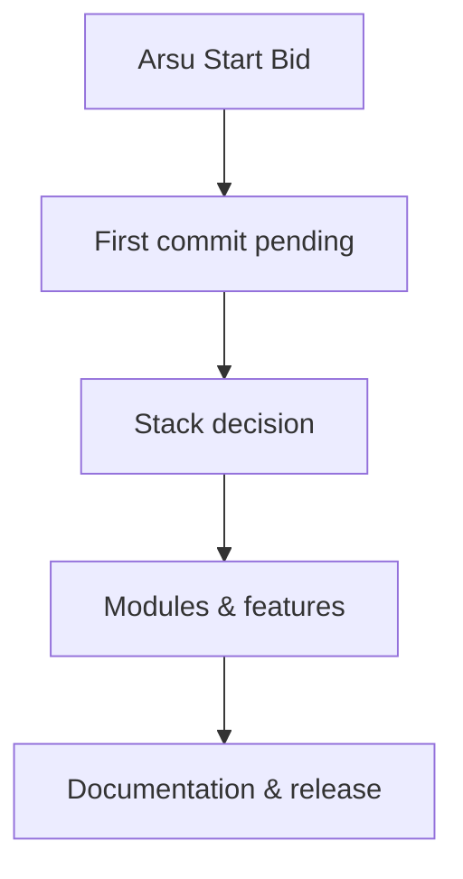

<p align="center">
  
</p>

<p align="center">
  
  
  
</p>

> **Developed by [Arslan Malik](https://github.com/arsalanmaalik461)**
> 📱 WhatsApp: [+92 300 8987448](https://wa.me/923008987448) · 🌐 Website: [arslanmalik.tech](https://arslanmalik.tech)

---

## 🌟 Executive Overview

**Arsu Start Bid** is a starter repository — the foundation of a bidding-related project, currently in its initial state. The repository was created fresh and is ready for the first commit, architecture decisions, and implementation.

This README will grow as the project takes shape: once the technology stack is chosen and the first modules are committed, this document will be expanded with real features, real architecture, and real setup instructions. For now it serves as the project's branded home page, so the repository looks professional from day one.

---

## 📑 Table of Contents

- [✨ Key Features & Highlights](#-key-features--highlights)
- [🖥️ Feature Showcase](#️-feature-showcase)
- [🏗️ System Architecture](#️-system-architecture)
- [🚀 Quickstart & Installation Guide](#-quickstart--installation-guide)
- [📂 Project Structure](#-project-structure)
- [🛡️ Security & Notes](#️-security--notes)

---

## ✨ Key Features & Highlights

| Feature | Description |
| :--- | :--- |
| 🌱 Starter foundation | Clean, empty repository ready for the bidding project's first code |
| 📄 Professional README | This branded document — grows with the project |
| 🎨 Brand assets | Project banner in `docs/assets/` for consistent presentation |
| 📬 Owner contact | Direct line to the developer via WhatsApp and website (header) |

---

## 🖥️ Feature Showcase

### 1. A clean starting point

> Every real project begins with a solid foundation.

- Empty main branch, no legacy code or technical debt
- Branded README and banner so the repo looks finished from the start
- Ready for the chosen stack, CI, and license to be added

### 2. Owner-maintained

> Built and maintained by Arslan Malik.

- Direct WhatsApp contact for questions or collaboration
- Updates land here as the project develops

---

## 🏗️ System Architecture



---

## 🚀 Quickstart & Installation Guide

### Prerequisites

- [Git](https://git-scm.com/) installed
- A GitHub account with access to this repository

### Step-by-Step Installation

```bash
# Clone the repository
git clone https://github.com/arsalanmaalik461/arsu-start-bid.git
cd arsu-start-bid

# Add your first files, then commit
git add .
git commit -m "chore: initial commit"
git push origin main
```

> Once the technology stack is decided, stack-specific setup instructions will replace this generic guide.

---

## 📂 Project Structure

```
arsu-start-bid/
├── README.md               # This document
└── docs/
    └── assets/
        └── banner.svg      # Project banner
```

---

## 🛡️ Security & Notes

- This repository is currently empty apart from documentation — no code, no secrets, nothing to audit yet.
- Never commit API keys, tokens, passwords, or private credentials to this repo.
- When code is added, add a license file and a `.gitignore` appropriate for the chosen stack.
- Questions or collaboration? Reach out on WhatsApp: [+92 300 8987448](https://wa.me/923008987448).

---

<p align="center">
  <sub>Developed with ❤️ by <a href="https://github.com/arsalanmaalik461">Arslan Malik</a> · 📱 <a href="https://wa.me/923008987448">WhatsApp: +92 300 8987448</a> · 🌐 <a href="https://arslanmalik.tech">arslanmalik.tech</a></sub>
</p>
